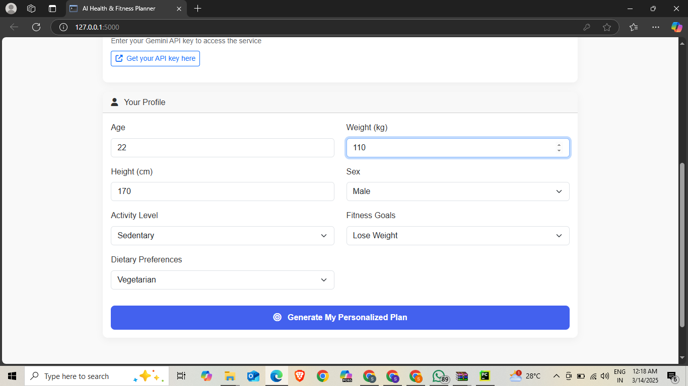
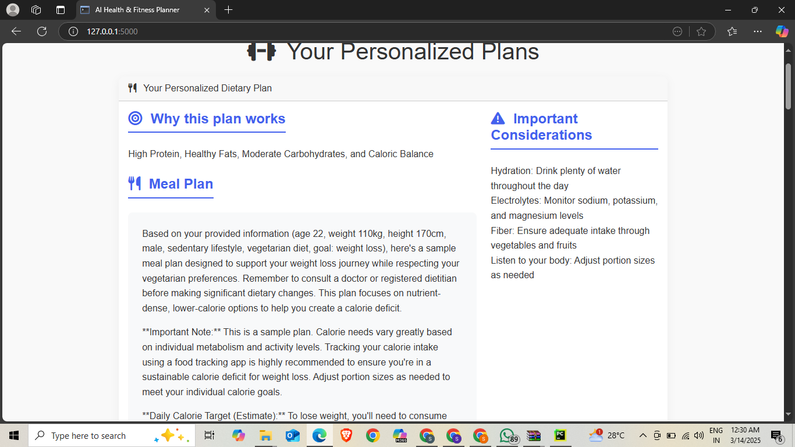
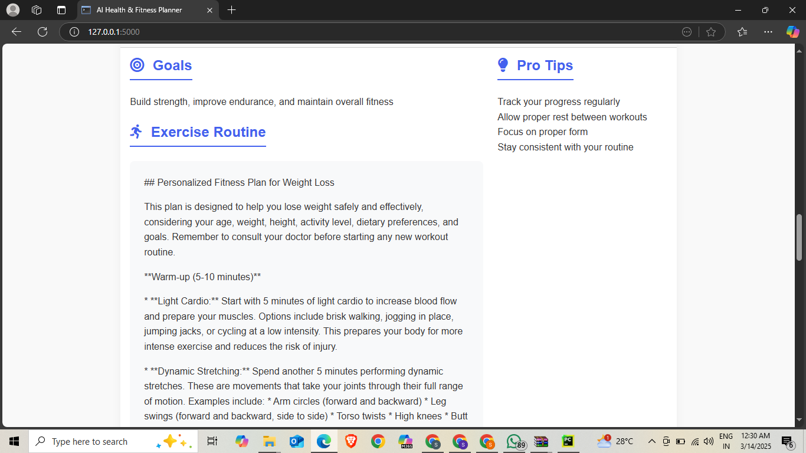

# FitGenius: AI Fitness Coach

## 🌟 Overview
FitGenius is an AI-powered health and fitness planner that provides **personalized dietary and workout recommendations**. Leveraging the **Google Gemini API**, **Flask**, and a **multi-agent system**, the platform delivers interactive fitness guidance tailored to individual needs and goals.

## 🚀 Features
* **Personalized AI Fitness & Diet Plans** powered by Google Gemini API
* **Multi-Agent System** with specialized **Diet** and **Fitness** agents for comprehensive recommendations
* **Flask-Based Web Application** for intuitive user interaction
* **Interactive Q&A Support** for customized fitness advice and plan adjustments
* **Dynamic Content Delivery** ensuring real-time plan optimization

## 🏗️ Tech Stack
* **Backend**: Python, Flask
* **AI & NLP**: Google Gemini API, Natural Language Processing (NLP)
* **Architecture**: Multi-Agent System

## 🔧 Installation & Setup

### Clone the Repository
```sh
git clone https://github.com/yourusername/FitGenius.git
```

### Navigate to the Project Directory
```sh
cd FitGenius
```

### Install Dependencies
```sh
pip install -r requirements.txt
```

### Set Up Environment Variables
```sh
# Create a .env file with your Google Gemini API key
echo "GEMINI_API_KEY=your_api_key_here" > .env
```

### Run the Flask App
```sh
python app.py
```

### Access the Application
Open [http://127.0.0.1:5000/](http://127.0.0.1:5000/) in your browser.

## 📸 Screenshots
  Upload the API key

  

  User's input

  

    Diet Plan

  
  

    Wokout Plan

  

  
## 🛠️ Future Enhancements
* **User Authentication** for personalized tracking and progress monitoring
* **Exercise and Diet Database Expansion** for more diverse recommendations
* **Machine Learning Integration** for adaptive fitness insights based on user progress
* **Full-Stack Web App** implementation with React or Vue frontend
* **Mobile App Development** for on-the-go fitness planning


## 💪 Stay fit and keep coding! 🚀
